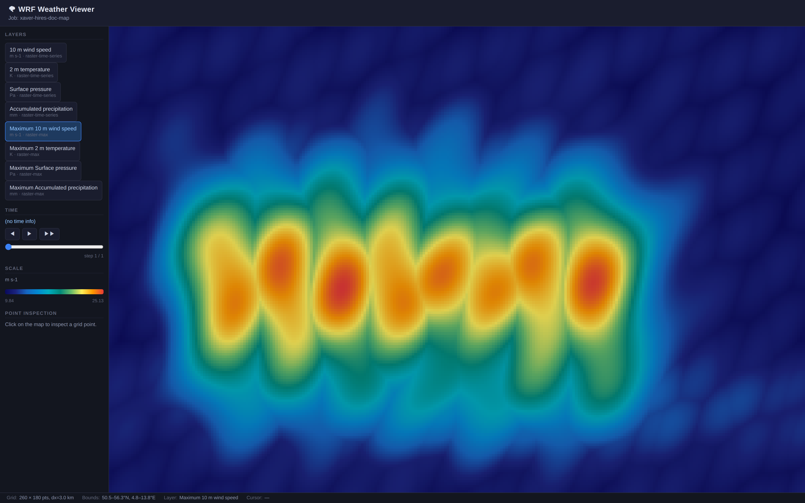

# WRF Workbench User Guide

This guide walks through the local Workbench UI using screenshots generated from
the real Storm Xaver browser flow and the WRF visualization viewer.

Generate or refresh the screenshots with:

```bash
sh ci/generate-user-guide-screenshots.sh
```

The same script runs in CI, regenerates the checked-in images and also uploads
review artifacts. The screenshots are stored in:

```text
doc/user-guide/screenshots/
```

## 1. Start the local Workbench

From the repository root:

```bash
python3 -m workbench.server.server --host 127.0.0.1 --port 8080
```

Open:

```text
http://127.0.0.1:8080/
```

The start screen shows the event search, preset selection panel, job preview
panel and status/log panel.


## 2. Search and select Storm Xaver

The UI starts with `Xaver` as a useful demo query.  Click `Select xaver` to load
its event details from the Workbench event catalogue.

The browser does not parse event files directly; it calls:

```http
GET /api/events?q=xaver
GET /api/events/xaver
```


## 3. Choose domain and resolution presets

Select a domain and a resolution preset.  The first UI version shows an
approximate rectangular domain preview so users can see that the selected event
has a concrete simulation area.

For the Xaver demo, the screenshot flow uses:

```text
Domain:     northern-germany-27km
Resolution: quick-preview
Mode:       dry-run
```


## 4. Preview the generated job config

Click `Preview job config`.

The UI calls:

```http
POST /api/jobs/preview
```

The server delegates event lookup and job config generation to Workbench core
logic.  The browser only renders the returned config and validation status.


## 5. Start the dry-run

Click `Start dry-run`.

The UI calls:

```http
POST /api/jobs
```

The local server executes the Workbench runner in a server-managed run
directory.  When the run completes, the status panel shows the job id, status,
run directory, logs and output count.


## 6. Inspect logs

The UI fetches logs through:

```http
GET /api/jobs/{id}/logs
```

For the dry-run path, the logs show the planned WRF workflow steps without
starting containers or downloading data.


## 7. Inspect computed weather-map results

The Workbench visualization pipeline converts model output into web-friendly
raster layers. The user-guide screenshot test generates a deterministic
high-resolution Xaver visualization dataset and opens the WRF Weather Viewer
with the `Maximum 10 m wind speed` layer selected.

The documentation map uses a generated 260 × 180 grid and a large browser
viewport so fronts, wind bands and pressure-related structures remain visible in
the checked-in screenshot. The lighter smoke screenshot test stays separate from
this documentation-quality map generation.



## 8. Run the cached ERA5-WRF acceptance path

The browser UI currently drives the dry-run path. The cacheable ERA5-WRF path is
covered by the Xaver acceptance script:

```bash
sh ci/test-xaver-demo.sh
```

That test verifies that the same Xaver scenario can create WPS/WRF namelists,
pipeline metadata and visualization metadata using cached ERA5 input.

For details, see:

```text
doc/XAVER_DEMO.md
doc/ERA5_WRF_PIPELINE.md
```

## Updating screenshots

When the UI or visualization changes intentionally:

1. Run `sh ci/generate-user-guide-screenshots.sh` locally.
2. Review the PNG files in `doc/user-guide/screenshots/`.
3. Commit the updated screenshots together with the UI/user-guide change.

CI also uploads generated screenshots as artifacts so reviewers can compare the
current browser output before merging changed images.
