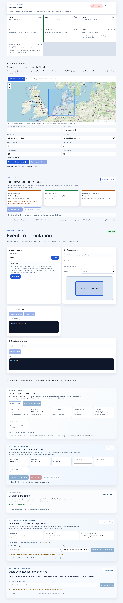
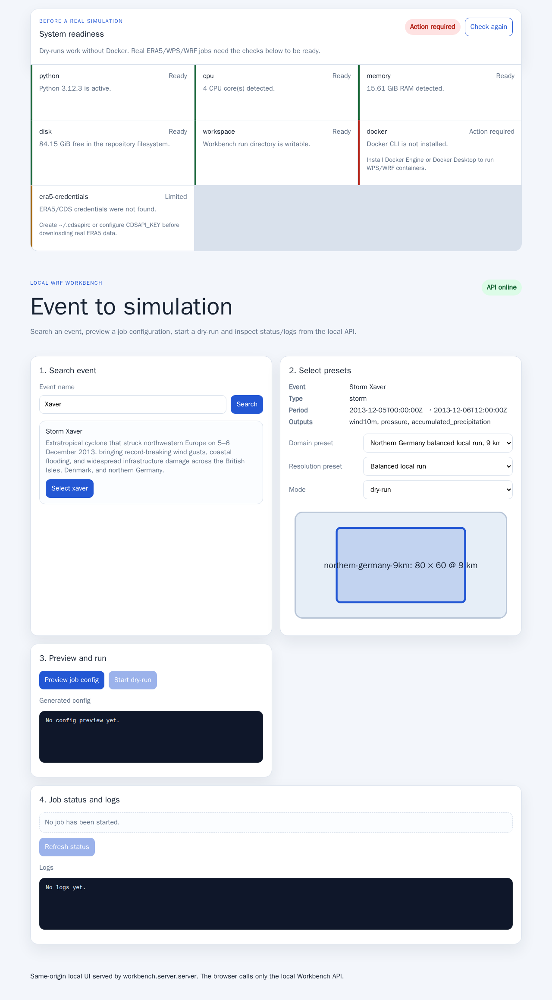
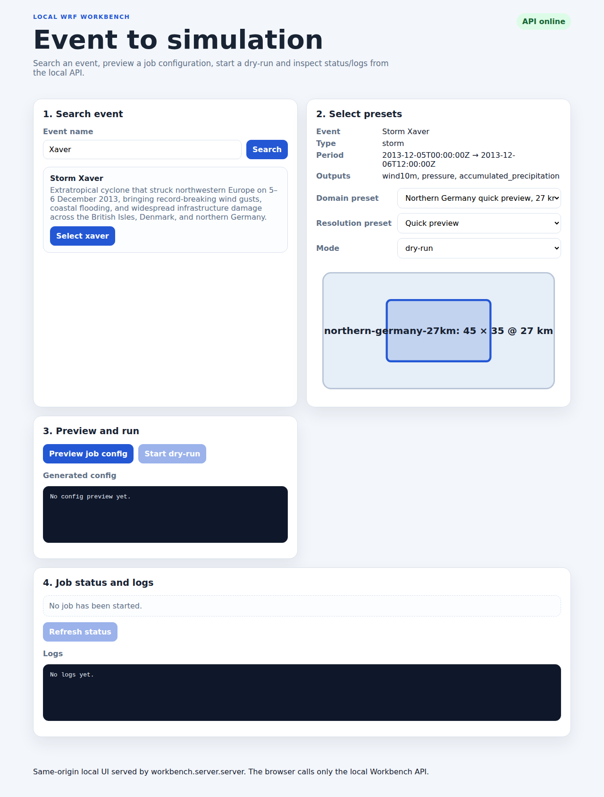
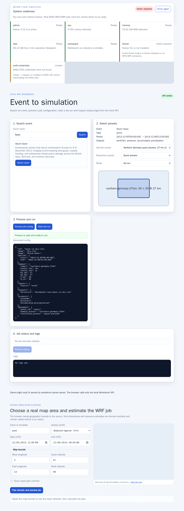
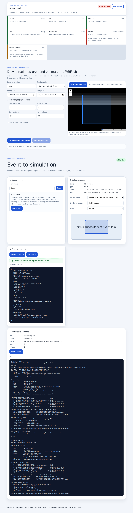

# WRF Workbench User Guide

This guide walks through the local Workbench UI using screenshots generated from
the Storm Xaver browser flow.

Generate or refresh the regular UI screenshots with:

```bash
sh ci/generate-user-guide-screenshots.sh
```

The same script runs in CI, regenerates the checked-in UI images and also uploads
review artifacts. The screenshots are stored in:

```text
doc/user-guide/screenshots/
```

## 1. Start the local Workbench

From the repository root:

```bash
python3 wrf-chammer doctor
python3 wrf-chammer start
```

Open:

```text
http://127.0.0.1:8080/
```

The start screen shows system readiness, event search, preset selection, guided
map planning, job preview and status/log panels.



## 2. Search and select Storm Xaver

The UI starts with `Xaver` as a useful demo query. Click `Select xaver` to load
its event details from the Workbench event catalogue.

The browser does not parse event files directly; it calls:

```http
GET /api/events?q=xaver
GET /api/events/xaver
```



## 3. Choose the simulation domain

There are two supported planning paths.

### 3.1 Guided map planning

The **Guided simulation planning** section uses a real OpenStreetMap basemap for
geographic context. It does not create or alter weather data.

For the Xaver reference plan, the defaults are:

```text
Bounds:     2.0–14.0° E, 51.0–58.0° N
Period:     2013-12-05 12:00 UTC to 2013-12-06 06:00 UTC
Profile:    balanced regional
Resolution: 9 km
```

Click `Plan domain and preview job`. The browser sends the geographic bounds and
quality profile to the server:

```http
POST /api/wizard/preview
```

The server derives the domain centre, physical extent, `e_we`, `e_sn`, time-step
recommendation and transparent estimates for runtime, RAM, ERA5 input and WRF
output. The result includes a validated Workbench job configuration; users do not
need to edit JSON or namelists.

Expert controls can override grid spacing, vertical levels and output interval.
All overrides are validated server-side.

For technical details and assumptions, see
[`SIMULATION_WIZARD.md`](SIMULATION_WIZARD.md).

### 3.2 Curated presets

The existing preset path remains available. Select a domain and a resolution
preset. It is useful for tested reference configurations and quick demonstrations.

For the original Xaver screenshot flow:

```text
Domain:     northern-germany-27km
Resolution: quick-preview
Mode:       dry-run
```



## 4. Preview the generated job config

Click `Preview job config` in the preset workflow, or use the generated preview
in the guided map workflow.

The preset UI calls:

```http
POST /api/jobs/preview
```

The server delegates event lookup and job config generation to Workbench core
logic. The browser only renders the returned config and validation status.



## 5. Start the dry-run

Click `Start dry-run` or `Start planned dry-run`.

The UI calls:

```http
POST /api/jobs
```

The local server executes the Workbench runner in a server-managed run
directory. When the run completes, the status panel shows the job id, status,
run directory, logs and output count.



## 6. Inspect logs

The UI fetches logs through:

```http
GET /api/jobs/{id}/logs
```

For the dry-run path, the logs show the planned WRF workflow steps without
starting containers or downloading data.


## 7. Inspect real computed weather-map results

Weather-map documentation screenshots must be generated from real WRF
visualization artifacts. The guide does not use artificial fields as stand-ins
for result maps.

After a real run has produced visualization artifacts containing `metadata.json`
and `layers/`, capture the weather-map screenshot with:

```bash
sh ci/generate-real-data-weather-map-screenshot.sh \
  workbench-runs/xaver-real/visualizations \
  max_wind10m
```

This creates:

```text
doc/user-guide/screenshots/xaver-07-weather-map.png
```

Commit that PNG only if it was generated from real visualization artifacts. If no
real-data screenshot is committed yet, this guide intentionally omits the weather
map image.

## 8. Run the cached ERA5-WRF acceptance path

The browser UI currently drives dry-run execution. The cacheable ERA5-WRF path is
covered by the Xaver acceptance script:

```bash
sh ci/test-xaver-demo.sh
```

That test verifies that the same Xaver scenario can create WPS/WRF namelists,
pipeline metadata and visualization metadata using cached ERA5 input.

For details, see:

```text
doc/XAVER_DEMO.md
doc/ERA5_WRF_PIPELINE.md
```

## Updating screenshots

When the UI changes intentionally:

1. Run `sh ci/generate-user-guide-screenshots.sh` locally.
2. Review the PNG files in `doc/user-guide/screenshots/`.
3. Commit the updated UI screenshots together with the UI/user-guide change.

When a real-data visualization changes intentionally, run the separate real-data
weather-map screenshot script and commit `xaver-07-weather-map.png` only if it
comes from real visualization artifacts.

CI also uploads generated regular UI screenshots as artifacts so reviewers can
compare the current browser output before merging changed images.
