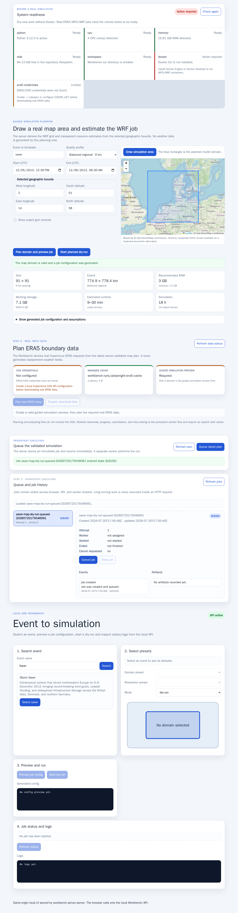

# WRF Workbench User Guide

This guide walks through the local Workbench UI using screenshots generated from
the Storm Xaver browser flow.

Generate or refresh the regular UI screenshots with:

```bash
sh ci/generate-user-guide-screenshots.sh
```

The same script runs in CI and uploads review artifacts. Intentionally changed
screenshots must be reviewed and committed together with the corresponding UI
change. The screenshots are stored in:

```text
doc/user-guide/screenshots/
```

## 1. Start the local Workbench

From the repository root:

```bash
python3 wrf-chammer doctor
python3 wrf-chammer start
```

`start` launches both the local API/UI and the persistent job worker. Inspect the
managed processes with:

```bash
python3 wrf-chammer status --json
python3 wrf-chammer logs --component all
```

Open:

```text
http://127.0.0.1:8080/
```

The start screen shows system readiness, guided map planning, ERA5 input-data
planning, persistent execution, queue/history, event search, preset selection,
job preview and status/log panels.


## 2. Search and select Storm Xaver

The UI starts with `Xaver` as a useful demo query. Click `Select xaver` to load
its event details from the Workbench event catalogue.

The browser does not parse event files directly; it calls:

```http
GET /api/events?q=xaver
GET /api/events/xaver
```


## 3. Choose the simulation domain and real input data

There are two supported domain-planning paths. The guided path additionally
connects the validated area and period to a reproducible ERA5 request plan.

### 3.1 Guided map planning

The **Guided simulation planning** section uses a real OpenStreetMap basemap for
geographic context. It does not create or alter weather data.

Click **Draw simulation area**, then drag a rectangle from one corner of the desired
domain to the opposite corner. The map selection updates west, south, east and
north. The coordinate fields remain available as a keyboard-accessible alternative
and update the rectangle in the opposite direction.

For the Xaver reference plan, the defaults are:

```text
Bounds:     2.0–14.0° E, 51.0–58.0° N
Period:     2013-12-05 12:00 UTC to 2013-12-06 06:00 UTC
Profile:    balanced regional
Resolution: 9 km
```

Click `Plan domain and preview job`. The browser sends the geographic bounds and
quality profile to the server:

```http
POST /api/wizard/preview
```

The server derives the domain centre, physical extent, `e_we`, `e_sn`, time-step
recommendation and transparent estimates for runtime, RAM, ERA5 input and WRF
output. The result includes a validated Workbench job configuration; users do not
need to edit JSON or namelists.


Expert controls can override grid spacing, vertical levels and output interval.
All overrides are validated server-side.

For technical details and assumptions, see
[`SIMULATION_WIZARD.md`](SIMULATION_WIZARD.md).

### 3.2 Plan real ERA5 boundary data

After the guided simulation preview is valid, open **Plan ERA5 boundary data** and
select `Refresh data status`. The status cards show:

- whether local Copernicus CDS credentials are configured;
- whether the managed cache is writable;
- how many content-addressed ERA5 plans already exist;
- whether the latest guided simulation preview is available.

Select `Plan real ERA5 data`. The browser requests a canonical data plan from the
server:

```http
POST /api/data/era5/plan
Content-Type: application/json

{
  "source": "latest-wizard-preview",
  "interval_hours": 1,
  "margin_degrees": 1
}
```

For the reference Xaver period, the plan contains four real ERA5 requests:

```text
2013-12-05: pressure levels + single levels
2013-12-06: pressure levels + single levels
Boundary times: 19 hourly time points including both endpoints
```

The panel displays the request count, estimated download size, cache coverage,
stable plan key and provenance. It also states explicitly:

```text
Artificial weather data: no
```


Select `Prepare download files` to atomically write the reproducible plan and the
existing downloader configuration format into the managed cache:

```text
.era5-cache/<plan-key>/era5-plan.json
.era5-cache/<plan-key>/era5-download-config.json
```

This operation performs no CDS request. The UI and API return
`download_started: false`. Network download, progress, cancellation and retry are
separate worker functions and are not implied by planning or preparing these
files.

For the API, security and cache details, see
[`ERA5_DATA_UI.md`](ERA5_DATA_UI.md) and
[`ERA5_DATA_PLANNING.md`](ERA5_DATA_PLANNING.md).

### 3.3 Curated presets

The existing preset path remains available. Select a domain and a resolution
preset. It is useful for tested reference configurations and quick demonstrations.

For the original Xaver screenshot flow:

```text
Domain:     northern-germany-27km
Resolution: quick-preview
Mode:       dry-run
```


## 4. Preview the generated job config

Click `Preview job config` in the preset workflow, or use the generated preview
in the guided map workflow.

The preset UI calls:

```http
POST /api/jobs/preview
```

The server delegates event lookup and job config generation to Workbench core
logic. The browser only renders the returned config and validation status.


## 5. Queue a persistent job

After a guided preview is valid, the **Queue the validated simulation** section
becomes active. Select `Queue latest plan`.

The browser creates a unique job id and calls:

```http
POST /api/jobs
Content-Type: application/json

{
  "execution": "queued",
  "start": true,
  "config": { "...": "the validated server preview" }
}
```

The API validates and stores the immutable configuration in SQLite, assigns a
managed output directory and returns immediately with `202 Accepted`. The
simulation is not executed inside the HTTP request.

The **Queue and job history** section shows jobs from previous browser and server
sessions. Selecting a job displays:

- current state and attempt;
- assigned worker and timestamps;
- append-only lifecycle events;
- errors with stable error codes;
- logs, outputs and visualization artifacts with SHA-256 checksums.



A waiting job can be cancelled with `Cancel job`. A running job first enters
`CANCELLING` while the worker stops its child process tree. `FAILED` and
`CANCELLED` jobs can be queued as a new attempt with `Retry job`; previous
attempts and artifacts remain available.

Relevant API endpoints:

```http
GET  /api/jobs
GET  /api/jobs/{id}
POST /api/jobs/{id}/cancel
POST /api/jobs/{id}/retry
GET  /api/jobs/{id}/events
GET  /api/jobs/{id}/artifacts
```

For the state model, recovery behavior and storage layout, see
[`JOB_ORCHESTRATION.md`](JOB_ORCHESTRATION.md).

## 6. Run the synchronous dry-run compatibility path

`Start dry-run` and `Start planned dry-run` remain available as a fast compatibility
path for demonstrations and small tests. They call:

```http
POST /api/jobs
```

without `execution: queued`. The local server executes that dry-run immediately
and returns the result in the same request. Real downloads and simulations should
use the persistent queue instead.


## 7. Inspect logs

For a synchronous compatibility run, the UI fetches logs through:

```http
GET /api/jobs/{id}/logs
```

For persistent jobs, logs appear in the artifact list and are indexed per attempt.
The local server and worker process logs are available through:

```bash
python3 wrf-chammer logs --component all
```


## 8. Inspect real computed weather-map results

Weather-map documentation screenshots must be generated from real WRF
visualization artifacts. The guide does not use artificial fields as stand-ins
for result maps.

After a real run has produced visualization artifacts containing `metadata.json`
and `layers/`, capture the weather-map screenshot with:

```bash
sh ci/generate-real-data-weather-map-screenshot.sh \
  workbench-runs/xaver-real/visualizations \
  max_wind10m
```

This creates:

```text
doc/user-guide/screenshots/xaver-07-weather-map.png
```

Commit that PNG only if it was generated from real visualization artifacts. If no
real-data screenshot is committed yet, this guide intentionally omits the weather
map image.

## 9. Run the cached ERA5-WRF acceptance path

The browser UI currently drives planning, queueing and dry-run execution. The
cacheable ERA5-WRF path is covered by the Xaver acceptance script:

```bash
sh ci/test-xaver-demo.sh
```

That test verifies that the same Xaver scenario can create WPS/WRF namelists,
pipeline metadata and visualization metadata using cached ERA5 input.

For details, see:

```text
doc/XAVER_DEMO.md
doc/ERA5_WRF_PIPELINE.md
```

## Updating screenshots

When the UI changes intentionally:

1. Run `sh ci/generate-user-guide-screenshots.sh` locally.
2. Review the PNG files in `doc/user-guide/screenshots/`.
3. Commit the updated UI screenshots together with the UI/user-guide change.

When a real-data visualization changes intentionally, run the separate real-data
weather-map screenshot script and commit `xaver-07-weather-map.png` only if it
comes from real visualization artifacts.

CI uploads generated regular UI screenshots as artifacts so reviewers can compare
the browser output before merging. CI does not modify pull request branches.
