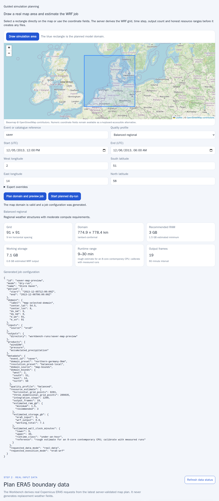
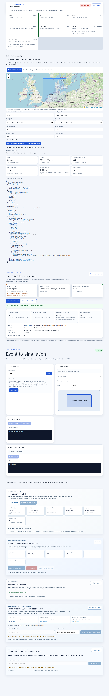

# WRF Workbench User Guide

This guide explains the local WRF Workbench through the Storm Xaver workflow. It
covers domain planning, real ERA5 acquisition, persistent simulation records and
the separate acceptance path for computed weather-map results.

## What the screenshots do — and do not — show

The guide uses three different visual categories. They must not be confused:

| Screenshot | Meaning | Contains computed weather? |
|---|---|---:|
| `xaver-01` to `xaver-06` | Search, configuration, planning, dry-run status and logs | No |
| `xaver-03b-map-domain-wizard.png` | OpenStreetMap basemap plus the selected WRF domain | No |
| `xaver-07-weather-map.png` | A rendered layer from real WRF output | Yes |

The checked-in planning screenshots were generated from the real interactive UI
with visible tiles from the canonical OpenStreetMap endpoint. The map-specific
screenshot has a sidecar provenance record:

```text
doc/user-guide/screenshots/
  xaver-03b-map-domain-wizard.png
  xaver-03b-map-domain-wizard.png.provenance.json
```

The provenance record binds the PNG SHA-256 to the tile URL template, tile host,
number of successful visible tile responses and the attribution text that was
visible when the screenshot was captured. Verify it with:

```bash
python3 ci/verify-user-guide-map-provenance.py
```

A green **User Guide Screenshots** workflow proves that the UI flow and planning
map render correctly. It does **not** prove that WRF produced a meteorological
field.

Normal pull-request CI does not contact the community OpenStreetMap tile server.
It intercepts tile requests with a deterministic local Natural Earth QA provider
and writes those temporary screenshots to:

```text
workbench-runs/ci-user-guide-screenshots/
```

That offline QA output never overwrites or masquerades as the checked-in
OpenStreetMap documentation images. A manually dispatched workflow may select
`openstreetmap`; its output is uploaded from
`workbench-runs/manual-openstreetmap-screenshots/` for explicit review.

Both the OpenStreetMap planning map and the offline Natural Earth QA rendering
are geographic context only. Neither contains weather data.

The computed result image `xaver-07-weather-map.png` is intentionally absent until
a complete real-data run has produced WRF-proven visualization artifacts and the
separate result-map test has verified that the selected field is spatially
varying and visibly rendered.

## Generate the regular UI screenshots

From the repository root, a human-reviewed OpenStreetMap capture is generated
with:

```bash
WRF_SCREENSHOT_BASEMAP=openstreetmap \
  sh ci/generate-user-guide-screenshots.sh
```

The command builds the modern UI, starts the real local Workbench server in the
browser integration environment and writes screenshots to:

```text
doc/user-guide/screenshots/
```

For deterministic offline QA, use a separate output directory:

```bash
WRF_SCREENSHOT_BASEMAP=offline-natural-earth \
WRF_SCREENSHOT_OUTPUT_DIR=workbench-runs/local-user-guide-screenshots \
  sh ci/generate-user-guide-screenshots.sh
```

The screenshot command captures:

```text
xaver-01-search.png
xaver-02-event-selected.png
xaver-03-domain-resolution.png
xaver-03b-map-domain-wizard.png
xaver-03c-era5-data-plan.png
xaver-04-preview-config.png
xaver-05-dry-run-status.png
xaver-06-logs.png
```

The command does not generate `xaver-07-weather-map.png`.

## 1. Start the local Workbench

From the repository root:

```bash
python3 wrf-chammer doctor
python3 wrf-chammer start
```

Open:

```text
http://127.0.0.1:8080/
```

The page contains system readiness, guided geographic planning, ERA5 data
controls, persistent simulation records and the original event/preset workflow.


## 2. Search and select Storm Xaver

The UI starts with `Xaver` as a useful reference query. Select the Xaver result to
load event metadata and curated presets from the server-side catalogue:

```http
GET /api/events?q=xaver
GET /api/events/xaver
```


## 3. Select a simulation domain

There are two supported planning paths.

### 3.1 Guided geographic planning

The **Guided simulation planning** section provides an interactive geographic
map. Select **Draw simulation area** and drag a rectangle, or enter coordinates
with the keyboard-accessible numeric fields.

The Xaver reference values are:

```text
Bounds:     2.0–14.0° E, 51.0–58.0° N
Period:     2013-12-05 12:00 UTC to 2013-12-06 06:00 UTC
Profile:    balanced regional
Resolution: 9 km
```

Select **Plan domain and preview job**. The browser calls:

```http
POST /api/wizard/preview
```

The server derives:

- domain centre and physical extent;
- `e_we` and `e_sn`;
- grid spacing and recommended time step;
- output-frame count;
- estimated RAM, storage and wall-clock range;
- a schema-valid preview configuration.

The blue rectangle is the planned model domain. OpenStreetMap roads, places,
boundaries and waters are geographic context. No meteorological values are
calculated in this view.



Basemap © [OpenStreetMap contributors](https://www.openstreetmap.org/copyright).
The capture provenance is stored beside the PNG and verified in CI.

Expert controls may override grid spacing, vertical levels and output interval.
All overrides are validated by the server. See
[`SIMULATION_WIZARD.md`](SIMULATION_WIZARD.md) for the assumptions.

### 3.2 Curated presets

The preset workflow remains useful for tested reference configurations:

```text
Domain:     northern-germany-27km
Resolution: quick-preview
Mode:       dry-run
```


## 4. Plan real ERA5 boundary data

A valid guided preview can be converted into a canonical ERA5 request plan.
Refresh the data status first. The panel reports:

- whether Copernicus CDS credentials are configured;
- whether the managed cache is writable;
- how many content-addressed plans exist;
- whether a guided preview is available.

Select **Plan real ERA5 data**. The browser sends:

```http
POST /api/data/era5/plan
Content-Type: application/json

{
  "source": "latest-wizard-preview",
  "interval_hours": 1,
  "margin_degrees": 1
}
```

For the reference period, the plan contains pressure-level and single-level
requests for 5 and 6 December 2013, with 19 hourly boundary times including both
endpoints. The UI shows request count, estimated size, cache coverage, stable plan
key and provenance. It must state:

```text
Artificial weather data: no
```



Select **Prepare download files** to atomically persist:

```text
.era5-cache/<plan-key>/era5-plan.json
.era5-cache/<plan-key>/request.json
.era5-cache/<plan-key>/era5-download-config.json
```

Preparation does not contact CDS and returns `download_started: false`.

## 5. Download and verify real ERA5 files

Select **Start real ERA5 download** only after reviewing the plan:

```http
POST /api/data/era5/downloads
```

The downloader is a persistent background process rather than an open HTTP
request. Its states are:

```text
QUEUED
RUNNING
CANCELLING
CANCELLED
FAILED
SUCCEEDED
```

The UI reports completed requests, current request, retry attempt and recent
structured events. A cancelled or failed job can reuse already verified cache
files.

After successful verification, the plan directory contains:
